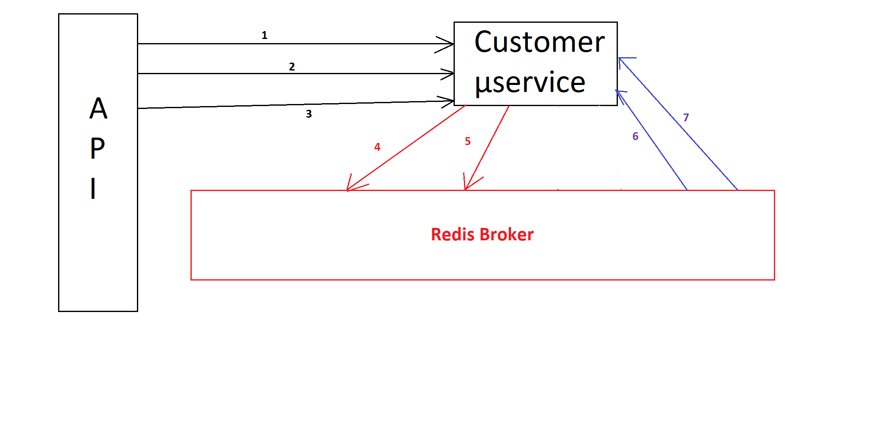

# Shop and Product management system

## description

This is an api build to create a microservices based application that allows their users to:

* A microservice application in which wharehouse managers can update the list of products for sale 
* Customers can list the products that are available and buy some of them
* Customers can subscribe for products that are out of stock so that they get an email notifying them when products are back on stock

## Architecture (customer micro-service wise)

1- the api sends a TCP request to the micro service for the list of available products 

2- the api sends a TCP request to the micro service for the list of bought products by a certaain customer

3- the api sends a TCP request to the micro service to save a buy operation made by a customer / subscripscribtion for a product out of the stock

4- the customer microservice sends an event to the other µservices notifying them of the buy operation

5- the customer microservice sends an event to the other mailing µservices notifying it that a customer is subscribed for a porduct out of the stock

6- the customer microservice listens to any new product added to update it's database

7- the customer microservice listens to any updates made over an existing product
